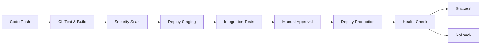

# Bands API - Developer Guide

> **Production-ready NestJS application with containerization, Kubernetes deployment, and CI/CD pipeline specifications.**

[](Dockerfile)
[](helm/)
[](helm/values-prod.yaml)
[](helm/templates/servicemonitor.yaml)


## 🎯 Project Overview

### ⚠️ DevOps Test Task Notes
- This repository originally contained both `package-lock.json` and `yarn.lock` files - a common anti-pattern. I've standardized on **npm** for consistency.
- npm ci used instead of npm install
- api request fixed to push brand via bands-api API
- Multi-stage Docker build
- Kubernetes configuration (auto-detects local vs production)
- Vault integration for secrets management
- Prometheus monitoring basic config if can we updated with ServiceMonitor and Operators if needed
- > Added CI/CD pipeline is a **demonstration implementation** created for this test task. In real-world scenarios, every CI/CD pipeline should be **uniquely tailored** to the specific team, project requirements, and organizational processes.
  > 
  > **Before implementing any CI/CD pipeline in production, it's essential to:**
  > - **Collaborate with the development team** to understand their workflow preferences
  > - **Assess existing infrastructure** and deployment processes  
  > - **Consider team size, release frequency,** and deployment strategies
  > - **Review current tooling** and integration requirements
  > - **Understand approval processes** and stakeholder involvement
  > 
  > The pipeline shown here includes comprehensive features (security scanning, coverage reporting, multi-environment deployments) that may not be necessary for all projects. **The key is implementing only what adds value** to your specific development workflow, not adopting every possible feature.


---

<br>

## 🐳 Deployment Guide
<details>
<summary><strong>📝 Specific Configurations To Remember About</strong></summary>

### MongoDB Database

| Environment | Database | Secrets | Access |
|-------------|----------|---------|--------|
| **Local** | Internal MongoDB K8s pod | Kubernetes Secrets | minikube access/port-forwarding|
| **Production** | External MongoDB Cluster | Vault | Istio/other Ingress |

### 📡 API Endpoints

| Endpoint | Methods | Description | Schema |
|----------|---------|-------------|--------|
| `/bands` | `GET`, `POST`, `DELETE` | Manage bands | `{"name": "string", "members": ["string"], "albums": number}` |
| `/health` | `GET` | Health check | `{"status": "ok", ...}` |
| `/metrics` | `GET` | Prometheus metrics | Prometheus format |
</details>

<br>

<details>
<summary><strong>📋 Complete Setup Instructions</strong></summary>

### System Requirements
- **Memory**: 4GB+ RAM for Minikube
- **CPU**: 2+ cores
- **Disk**: 10GB+ free space

### Required Tools

| Tool | Version | Installation |
|------|---------|--------------|
| Docker | 20.0+ | `brew install docker` |
| Minikube | 1.25+ | `brew install minikube` |
| kubectl | 1.24+ | `brew install kubectl` |
| Helm | 3.8+ | `brew install helm` |
| Node.js | 18+ | `brew install node` |

### Step-by-Step Deployment

#### 1. Environment Setup
```bash
# Start Minikube with sufficient resources
minikube start --memory=4096 --cpus=2 --driver=docker

# Enable required addons
minikube addons enable metrics-server

# Configure Docker environment
eval $(minikube docker-env)
```

#### 2. Build Application
```bash
# Build Docker image
docker build -t bands-api:latest .

# Verify image
docker images | grep bands-api
```

#### 3. Setup Helm Dependencies
```bash
# Add MongoDB repository
helm repo add bitnami https://charts.bitnami.com/bitnami
helm repo update

# Update dependencies
cd helm && helm dependency update && cd ..
```

#### 4. Deploy Application
```bash
# Deploy with Helm
helm install bands-api ./helm \
  --namespace bands-api \
  --create-namespace \
  --values ./helm/values-local.yaml \
  --wait --timeout=600s
```

#### 5. Verify Deployment
```bash
# Check pods
kubectl get pods -n bands-api

# Check services
kubectl get svc -n bands-api

# View logs
kubectl logs -f deployment/bands-api -n bands-api
```

#### 6. Application Access

| Method | Command | Use Case |
|--------|---------|----------|
| **Port Forward** | `kubectl port-forward service/bands-api 3000:80 -n bands-api` | **Recommended for local** |
| **NodePort** | `minikube service bands-api -n bands-api --url` | Alternative access |
| **Direct Service** | `kubectl get svc -n bands-api` | Service debugging |

#### 7. Test the API
```bash
# Get all bands
curl http://localhost:3000/bands

# Create a band
curl -X POST http://localhost:3000/bands \
  -H "Content-Type: application/json" \
  -d '{"name":"Test Band","genre":"Rock","members":["John","Jane"],"albums":1}'
```
</details>

---

<br>

## 🔧 Troubleshooting

<details>
<summary><strong>🚨 Common Issues & Solutions</strong></summary>

### Image Pull Errors
**Issue**: `ImagePullBackOff` errors
```bash
# Solution: Rebuild in Minikube context
eval $(minikube docker-env)
docker build -t bands-api:latest .
```

### MongoDB Connection Issues
**Issue**: Application can't connect to database
```bash
# Check MongoDB pod
kubectl get pods -n bands-api | grep mongodb
kubectl logs deployment/bands-api-mongodb -n bands-api

# Test connectivity
kubectl exec -it deployment/bands-api -n bands-api -- nslookup bands-api-mongodb
or
kubectl exec -it deployment/bands-api-mongodb -n bands-api -- mongosh --eval "db.adminCommand('ping')"
```

### Pod Startup Issues
**Issue**: Pods in `CrashLoopBackOff`
```bash
# Debug pod issues
kubectl describe pod <pod-name> -n bands-api
kubectl logs <pod-name> -n bands-api --previous
```

### Quick Debug Commands
```bash
# Get all resources
kubectl get all -n bands-api

# Check events
kubectl get events -n bands-api --sort-by='.lastTimestamp'

# Resource usage
kubectl top pods -n bands-api
```

</details>

---

<br>

## 🏗️ CI/CD Pipeline Overview


<details>
<summary><strong>🔍 Detailed Pipeline Specification - GitLab CI Implementation</strong></summary>

### Complete `.gitlab-ci.yml` Implementation

```yaml
# GitLab CI/CD Pipeline for Bands API
# Implements 9-stage pipeline with security, testing, and deployment

stages:
  - code-quality
  - build
  - security-scan
  - staging-deploy
  - integration-tests
  - manual-approval
  - production-deploy
  - health-check
  - rollback

variables:
  DOCKER_DRIVER: overlay2
  DOCKER_TLS_CERTDIR: "/certs"
  IMAGE_NAME: "$CI_REGISTRY_IMAGE/bands-api"
  HELM_CHART_PATH: "./helm"

# Global job timeout to prevent zombie jobs
default:
  timeout: 30m

# YAML Anchors for reusability
.node_base: &node_base
  image: node:18-alpine
  cache:
    paths:
      - node_modules/
  before_script:
    - npm ci

.docker_base: &docker_base
  image: docker:24-dind
  services:
    - docker:24-dind
  before_script:
    - echo $CI_REGISTRY_PASSWORD | docker login -u $CI_REGISTRY_USER --password-stdin $CI_REGISTRY

.helm_repos: &helm_repos
  - helm repo add bitnami https://charts.bitnami.com/bitnami
  - helm repo update

.kubectl_base: &kubectl_base
  image: alpine/helm:3.12.0
  before_script:
    - apk add --no-cache curl kubectl
    - *helm_repos

.default_rules: &default_rules
  rules:
    - if: $CI_PIPELINE_SOURCE == "merge_request_event"
    - if: $CI_COMMIT_BRANCH == $CI_DEFAULT_BRANCH

.main_branch_only: &main_branch_only
  rules:
    - if: $CI_COMMIT_BRANCH == $CI_DEFAULT_BRANCH

# Stage 1: Code Quality & Testing (Parallel Jobs)
lint:
  <<: *node_base
  stage: code-quality
  script:
    - npm run test:ci
  <<: *default_rules

helm-lint:
  <<: *kubectl_base
  stage: code-quality
  script:
    - cd $HELM_CHART_PATH
    - helm dependency update
    - helm lint .
    - helm template bands-api . --values values-local.yaml --dry-run
    - helm template bands-api . --values values-prod.yaml --dry-run
  <<: *default_rules

unit-tests:
  <<: *node_base
  stage: code-quality
  script:
    - npm run test:cov
    - mkdir -p coverage-reports
    - cp coverage/cobertura-coverage.xml coverage-reports/unit-coverage.xml
  coverage: '/All files[^|]*\|[^|]*\s+([\d\.]+)/'
  artifacts:
    reports:
      coverage_report:
        coverage_format: cobertura
        path: coverage/cobertura-coverage.xml
      junit: junit.xml
    paths:
      - coverage/
      - coverage-reports/
    expire_in: 1 week
  <<: *default_rules

e2e-tests:
  <<: *node_base
  stage: code-quality
  script:
    - npm run test:e2e
    - mkdir -p coverage-reports
    # Generate coverage for e2e tests if configured
    - npm run test:e2e:cov || echo "E2E coverage not configured"
    - cp coverage/cobertura-coverage.xml coverage-reports/e2e-coverage.xml || echo "No E2E coverage file"
  artifacts:
    reports:
      junit: e2e-junit.xml
    paths:
      - e2e-results/
      - coverage-reports/
    expire_in: 1 week
  <<: *default_rules

# Coverage aggregation job
coverage-report:
  <<: *node_base
  stage: code-quality
  dependencies:
    - unit-tests
    - e2e-tests
  script:
    - npm install -g nyc
    - mkdir -p final-coverage
    # Merge coverage reports if both exist
    - |
      if [ -f coverage-reports/unit-coverage.xml ] && [ -f coverage-reports/e2e-coverage.xml ]; then
        nyc merge coverage-reports/ final-coverage/merged-coverage.json
        nyc report --reporter=cobertura --report-dir=final-coverage
        echo "✅ Coverage reports merged successfully"
      else
        echo "⚠️ Using unit test coverage only"
        cp coverage-reports/unit-coverage.xml final-coverage/cobertura-coverage.xml || cp coverage/cobertura-coverage.xml final-coverage/
      fi
  coverage: '/All files[^|]*\|[^|]*\s+([\d\.]+)/'
  artifacts:
    reports:
      coverage_report:
        coverage_format: cobertura
        path: final-coverage/cobertura-coverage.xml
    paths:
      - final-coverage/
    expire_in: 1 week
  <<: *default_rules

# Stage 2: Build & Package
build:
  <<: *docker_base
  stage: build
  script:
    - |
      docker build -t $IMAGE_NAME:$CI_COMMIT_SHA \
        --label org.opencontainers.image.revision=$CI_COMMIT_SHA \
        --label org.opencontainers.image.source=$CI_PROJECT_URL .
    - docker tag $IMAGE_NAME:$CI_COMMIT_SHA $IMAGE_NAME:latest
    - docker push $IMAGE_NAME:$CI_COMMIT_SHA
    - docker push $IMAGE_NAME:latest
    # Smoke test
    - docker run --rm -d --name smoke-test $IMAGE_NAME:$CI_COMMIT_SHA
    - sleep 10
    - docker exec smoke-test curl -f http://localhost:3000/health || exit 1
    - docker stop smoke-test
    # Cleanup containers/images
    - docker container prune -f
    - docker image prune -f
  <<: *default_rules

# Stage 3: Security Scanning (Parallel Jobs)
snyk-dependency-scan:
  <<: *node_base
  stage: security-scan
  before_script:
    - npm ci
    - npm install -g snyk
    - snyk auth $SNYK_TOKEN
  script:
    - snyk test --severity-threshold=high --json > snyk-results.json || true
    - snyk monitor --project-name=bands-api
  artifacts:
    reports:
      dependency_scanning: snyk-results.json
    paths:
      - snyk-results.json
    expire_in: 1 week
  allow_failure: false
  <<: *main_branch_only

trivy-container-scan:
  <<: *docker_base
  stage: security-scan
  script:
    # Scan for report (non-blocking)
    - trivy image --exit-code 0 --format template --template "@contrib/sarif.tpl" -o trivy-results.sarif $IMAGE_NAME:$CI_COMMIT_SHA || true
    # Fail pipeline if HIGH or CRITICAL found
    - trivy image --exit-code 1 --severity HIGH,CRITICAL $IMAGE_NAME:$CI_COMMIT_SHA
    # Filesystem scan for report (non-blocking)
    - trivy fs --exit-code 0 --format template --template "@contrib/sarif.tpl" -o trivy-fs-results.sarif . || true
    # Fail pipeline if HIGH or CRITICAL found in filesystem
    - trivy fs --exit-code 1 --severity HIGH,CRITICAL .
  artifacts:
    reports:
      sast: trivy-results.sarif
    paths:
      - trivy-results.sarif
      - trivy-fs-results.sarif
    expire_in: 1 week
  allow_failure: false
  <<: *main_branch_only

# Stage 4: Deploy to Staging
staging-deploy:
  <<: *kubectl_base
  stage: staging-deploy
  environment:
    name: staging
    url: https://bands-api-staging.example.com
  before_script:
    - apk add --no-cache curl kubectl
    - echo "$KUBECONFIG_STAGING" | base64 -d > /tmp/kubeconfig
    - export KUBECONFIG=/tmp/kubeconfig
    - *helm_repos
  script:
    - cd $HELM_CHART_PATH
    - helm lint .
    - helm dependency update
    - helm upgrade --install bands-api-staging . 
        --namespace bands-api-staging 
        --create-namespace 
        --values values-staging.yaml 
        --set image.tag=$CI_COMMIT_SHA 
        --atomic --cleanup-on-fail 
        --wait --timeout=600s
    - kubectl rollout status deployment/bands-api-staging -n bands-api-staging
  <<: *main_branch_only

# Stage 5: Integration Tests
integration-tests:
  <<: *node_base
  stage: integration-tests
  environment:
    name: staging
  before_script:
    - npm ci
    - apk add --no-cache curl
  script:
    # API Health Check
    - curl -f https://bands-api-staging.example.com/health
    # API Integration Tests
    - npm run test:integration -- --baseUrl=https://bands-api-staging.example.com
    # Performance Tests (basic load test)
    - |
      for i in {1..100}; do
        curl -s -o /dev/null -w "%{http_code}\n" https://bands-api-staging.example.com/bands &
      done
      wait
  artifacts:
    reports:
      junit: integration-test-results.xml
    paths:
      - integration-test-results.xml
    expire_in: 1 week
  <<: *main_branch_only

# Stage 6: Manual Approval Gate
manual-approval:
  stage: manual-approval
  image: alpine:latest
  script:
    - echo "Manual approval required for production deployment"
    - echo "Staging URL: https://bands-api-staging.example.com"
    - echo "Test results available in pipeline artifacts"
  when: manual
  allow_failure: false
  environment:
    name: production
    action: prepare
  <<: *main_branch_only

# Stage 7: Production Deployment
production-deploy:
  <<: *kubectl_base
  stage: production-deploy
  environment:
    name: production
    url: https://bands-api.example.com
  before_script:
    - apk add --no-cache curl kubectl
    - echo "$KUBECONFIG_PROD" | base64 -d > /tmp/kubeconfig
    - export KUBECONFIG=/tmp/kubeconfig
    - *helm_repos
  script:
    - cd $HELM_CHART_PATH
    - helm lint .
    - helm dependency update
    # Blue-Green deployment strategy
    - helm upgrade --install bands-api . 
        --namespace bands-api-prod 
        --create-namespace 
        --values values-prod.yaml 
        --set image.tag=$CI_COMMIT_SHA 
        --atomic --cleanup-on-fail 
        --wait --timeout=600s
    - kubectl rollout status deployment/bands-api -n bands-api-prod
    # Verify deployment
    - kubectl get pods -n bands-api-prod
    - kubectl get svc -n bands-api-prod
  rules:
    - if: $CI_COMMIT_BRANCH == $CI_DEFAULT_BRANCH
      when: manual

# Stage 8: Health Check & Monitoring
health-check:
  stage: health-check
  image: alpine:latest
  environment:
    name: production
  before_script:
    - apk add --no-cache curl jq
  script:
    # Health endpoint verification
    - curl -f https://bands-api.example.com/health
    # Metrics endpoint verification
    - curl -f https://bands-api.example.com/metrics
    # Basic functionality test
    - |
      response=$(curl -s https://bands-api.example.com/bands)
      echo "API Response: $response"
    # Prometheus metrics check (if available)
    - |
      if curl -s https://prometheus.example.com/api/v1/query?query=up{job="bands-api"} | jq -r '.data.result[0].value[1]' | grep -q "1"; then
        echo "✅ Service is up in Prometheus"
      else
        echo "❌ Service not healthy in Prometheus"
        exit 1
      fi
  retry:
    max: 3
    when: script_failure
  <<: *main_branch_only

# Stage 9: Rollback (on failure)
rollback:
  <<: *kubectl_base
  stage: rollback
  environment:
    name: production
    action: stop
  before_script:
    - apk add --no-cache kubectl
    - echo "$KUBECONFIG_PROD" | base64 -d > /tmp/kubeconfig
    - export KUBECONFIG=/tmp/kubeconfig
  script:
    - echo "🚨 Rolling back to previous version"
    - helm rollback bands-api -n bands-api-prod
    - kubectl rollout status deployment/bands-api -n bands-api-prod
    - echo "✅ Rollback completed"
  when: on_failure
  <<: *main_branch_only

# Notification job (runs on pipeline completion)
notify:
  stage: .post
  image: alpine:latest
  dependencies:
    - coverage-report
  before_script:
    - apk add --no-cache curl jq
  script:
    - |
      # Extract coverage percentage from final coverage report
      COVERAGE_PERCENT=$(grep -o 'lines.*%' final-coverage/cobertura-coverage.xml | head -1 | grep -o '[0-9]*' || echo "N/A")
      
      if [ "$CI_PIPELINE_STATUS" == "success" ]; then
        curl -X POST "$SLACK_WEBHOOK_URL" \
          -H 'Content-type: application/json' \
          --data "{\"text\":\"✅ Bands API deployed successfully to production!\n📊 Coverage: ${COVERAGE_PERCENT}%\n🔗 Production: https://bands-api.example.com\n🧪 Staging: https://bands-api-staging.example.com\"}"
      else
        curl -X POST "$SLACK_WEBHOOK_URL" \
          -H 'Content-type: application/json' \
          --data "{\"text\":\"❌ Bands API deployment failed!\n📊 Coverage: ${COVERAGE_PERCENT}%\n🔗 Pipeline: $CI_PIPELINE_URL\n🧪 Staging: https://bands-api-staging.example.com\"}"
      fi
  rules:
    - if: $CI_COMMIT_BRANCH == $CI_DEFAULT_BRANCH
      when: always
```

### 🎯 Pipeline Success Metrics
- **Deployment Frequency**: Daily deployments
- **Lead Time**: < 2 hours commit to production  
- **Mean Time to Recovery**: < 30 minutes
- **Change Failure Rate**: < 5%
- **Test Coverage**: > 80%

### 📋 Required GitLab Variables
```bash
# Container Registry
CI_REGISTRY_IMAGE=registry.gitlab.com/your-group/bands-api
CI_REGISTRY_USER=gitlab-ci-token
CI_REGISTRY_PASSWORD=<token>

# Security Scanning
SNYK_TOKEN=<snyk-api-token>

# Kubernetes Configs (base64 encoded)
KUBECONFIG_STAGING=<base64-encoded-kubeconfig>
KUBECONFIG_PROD=<base64-encoded-kubeconfig>

# Notifications
SLACK_WEBHOOK_URL=https://hooks.slack.com/services/...
```

### 📦 Required package.json Script
Add this to your `package.json` for the centralized CI script:
```json
{
  "scripts": {
    "test:ci": "npm run lint && npm run format:check && npm run test:cov && npm run test:e2e"
  }
}
```

</details>

---
<br>

## 🎯 Next Steps
<details>
<summary><strong>Cleanup</strong></summary>

### Remove Deployment
```bash
# Uninstall application
helm uninstall bands-api -n bands-api
kubectl delete namespace bands-api

# Stop Minikube
minikube stop
minikube delete  # Optional: complete cleanup
```

### Clean Docker Images
```bash
# Remove built images
docker rmi bands-api:latest
docker system prune -f
```
</details>

<br>

<details>
<summary><strong>After successful deployment:</strong></summary>

| Task | Description |
|------|-------------|
| **🔍 Explore API** | Test endpoints with curl |
| **⚙️ Local Config** | Modify `helm/values-local.yaml` |
| **📊 Monitor** | Access metrics at `/metrics` endpoint |
| **🏭 Production Config** | Use `helm/values-prod.yaml` for production deployment |
</details>
